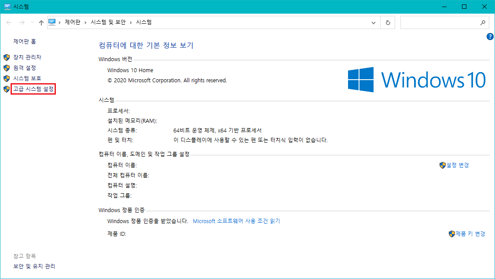
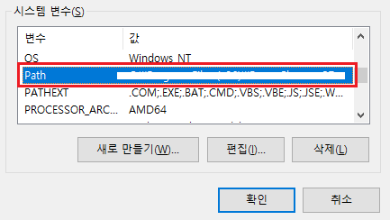
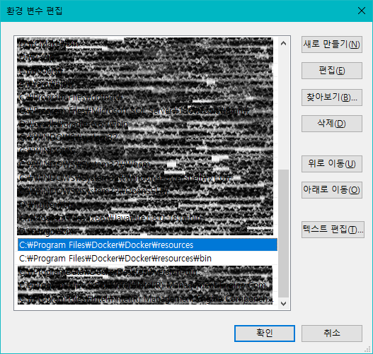
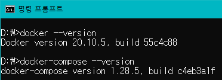

**도커를 사용하는 이유:**  
개발 환경을 동일하게 맞추어 환경에 따른 오류가 발생하지 않게 하기 위해 사용한다.

> 저 사람의 컴퓨터(환경)에서는 코드(프로그램)가 잘 돌아가는데, 왜 내 컴퓨터(환경)에서는 안되는 거지?

와 같은 상황을 사전에 방지하기 위해 사용한다.

# What is Docker?

도커란 컨테이너 기반의 가상화 시스템이다.

가상화는 실제 존재하지 않는 것을 존재하는 것처럼 만들어 주는 것을 의미한다.  
간단한 예로는 컴퓨터의 하나의 하드 디스크의 파티션을 나누어서 2개 이상의 드라이브로 사용하는 것을 볼 수 있다.

또 다른 예로는 `VirtualBox`를 사용해 Windows 안에 Windows 혹은 Linux를 띄우거나 `Parallels`를 사용해 Mac OS 안에서 Windows를 띄워 사용하는 것도 있다.

이런 가상화를 주로 사용하는 곳은 클라우드 서비스를 지원하는 곳이다. 하나의 컴퓨터를 여러 대의 컴퓨터처럼 나누면 여러 고객에게 서비스가 가능하기 때문에 사용한다. 하지만 하나의 컴퓨터에서 OS 단부터 구성하는 가상화를 사용하게 된다면 기본적으로 너무 많은 자원을 소모하게 된다. 그래서 이럴 때 사용하는 것이 도커와 같은 컨테이너 기반의 가상화 시스템이다.

Ubuntu, CentOS, RedHat과 같은 OS들은 모두 동일한 Linux 커널을 사용하기 때문에 이러한 동일한 부분을 공유하고 그 위에 필요한 부분만 나누어 가볍게 가상화하는 것이 도커이다.

그래서 누군가가 구성한 어떠한 환경을 이미지로 공유하면 그 이미지를 통해 간단하게 환경 구성이 가능하다.

# Docker Install

도커는 현재 Linux를 포함하여 Windows, Mac OS에서도 설치 및 사용이 가능하지만 애초에 도커라는 것이 Linux 커널을 전제로 만들어 졌기 때문에 실제 Linux 상에서 사용하는 도커만큼의 성능이 나오지 않으며, GPU 또한 사용이 불가능하다.

## Windows docker

[docker/get-started](https://www.docker.com/get-started)에서 `Docker Desktop for Windows` 설치

`docker` command 사용을 위한 환경 변수 설정

설치된 Docker의 결로 확인

`docker`: C:\Program Files\Docker\Docker\resources  
`docker-compose`: C:\Program Files\Docker\Docker\resources\bin

제어판 > 시스템 및 보안 > 시스템

고급 시스템 설정 클릭

고급 탭 환경 변수 클릭

docker, docker-compose의 각 실행 파일의 경로 등록

명령어 동작 확인

