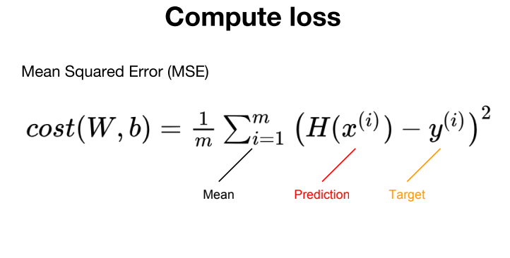
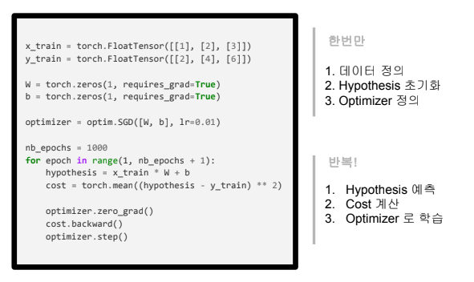

# 선형 회귀 [Linear regression]

선형 회귀는 데이터들의 관계를 하나의 선으로 표현할 수 있는 그 '선'을 구하는 방법이다. 그리고 그 선을 이용하면, 새로운 데이터에 대한 값을 예측하는 것이 가능하다. 이것은 관계를 이루고 있는 데이터들이 그 '선'이 의미하는 평균 값으로 돌아오는 특성을 사용한 것이다.

이에 대한 예시로 '공부한 시간'에 따른 '성적'이라는 데이터를 들 수 있다.


위의 데이터 세트와 같이 '공부한 시간(Hours)'에 따라 '성적(Points)'이 이렇게 있는 경우. 공부를 4시간을 했을 때의 성적은 어떻게 될지 구하기 위한 가설을 세워보자.

## 가설 [Hypothesis]

이 문제에서의 가설은 하나의 선을 표현하는 식을 의미한다. 즉, 직선의 방정식 $$y = Wx + b$$이다.
이 식을 `Hypothesis`의 앞 글자를 따서 $$H(x) = Wx + b$$로 표현하기도 한다.

위의 데이터 정의와 가설을 정의하는 과정을 `PyTorch`를 이용해 코드를 작성하면 다음과 같다.

```python
# 데이터 정의
x_train = torch.FloatTensor([[1], [2], [3]]) # Hours
y_train = torch.FloatTensor([[2], [4], [6]]) # Points

W = torch.zeros(1, requires_grad=True)
b = torch.zeros(1, requires_grad=True)
hypothesis = x_train * W + b
```

위 코드에서 Weight와 Bias는 0으로 초기화를 하며, `requires_grad=True`로 작성함을 통해 학습을 진행할 것이라고 명시한다.

## 손실 함수 [Compute loss]

이후 올바른 Weight와 Bias 값을 찾아가는 과정이 학습이라고 한다. 그리고 이러한 학습을 진행하기 위해서는 정답과의 오차를 통해 구할 수 있다. 여기서 오차를 구하는 식으로 'Mean Squared Error(MSE)'을 사용한다.

명칭 그대로 정답과 예착 값의 오차에 대한 평균을 구하는 것을 의미하며, 식으로는 다음과 같이 표현한다.



이 수식에 대해 코드로 작성하면 다음과 같다.

```python
cost = torch.mean((hypothesis - y_train) ** 2)
```

## 경사 하강법 [Gradient descent]

그리고 이를 경사하강법을 이용해 학습하는 과정을 코드로 표현하면 다음과 같다.

```python
optimizer = optim.SGD([W, b], lr=0.01)

optimizer.zero_grad() # gradient 초기화
cost.backward()       # gradient 계산
optimizer.step()      # 개선 (값 변경)
```

이러한 전체 과정을 한 번에 확인하면 다음과 같이 나타낸다.


