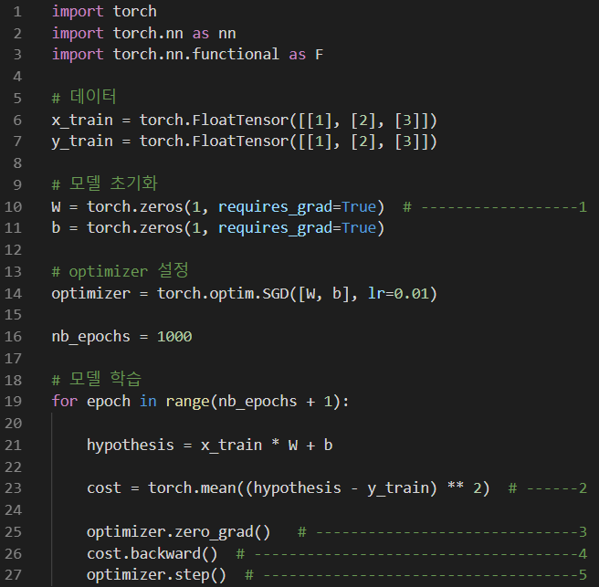
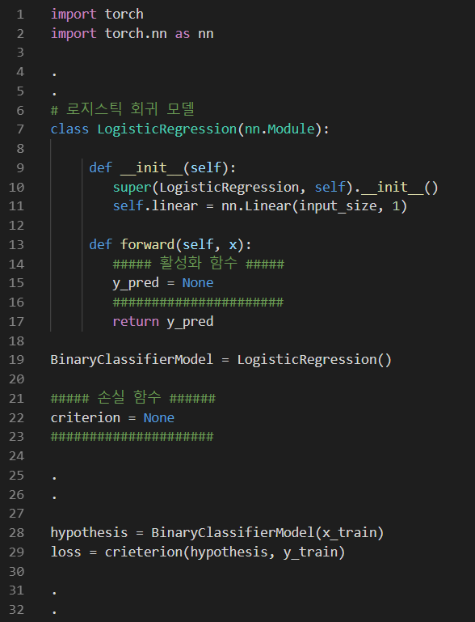

## Quiz - DNN

### Q-1
다음 중 Python의 Library 및 Package에 대한 설명으로 옳지 않은 것은?
1. torch.utils.data : Mini-batch 학습을 위한 패키지이다.
2. torch : 최근 2.0버전으로 업데이트 되었으며, 내장되어 있는 Keras를 이용하여 High-level 구현이 가능하다.
3. numpy : Scientific computing과 관련된 여러 편리한 기능들을 제공해주는 라이브러리이다.
4. matplotlib.pyplot : 데이터 시각화를 위한 다양한 기능을 제공하는 패키지이다.
5. torchvision : PyTorch 에서 이미지 데이터 로드와 관련된 여러가지 편리한 함수들을 제공하는 라이브러리이다.

답: 2 - Tensorflow에 대한 설명이다.

### Q-2
`torch.Tensor` 에 대한 설명으로 다음 중 옳지 않은 것은?
1. 다차원 배열(Multi-dimensional Matrix)을 처리하기 위한 가장 기본이 되는 자료형(Data Type)이다.
2. NumPy의 ndarray 와 마찬가지로 브로드캐스팅(Broadcasting) 적용이 가능하다.
3. NumPy의 ndarray와 거의 비슷하지만, GPU 연산을 함으로써 computing power를 극대화 시킬 수 있다.
4. torch.Tensor의 사칙연산은 torch.Tensor 간이나 torch.Tensor와 Python의 Scala 값 뿐만 아니라 Numpy의 ndarray와도 연산이 가능하다.
5. 기본텐서 타입(Default Tensor Type)으로 32비트의 부동소수점(Float) torch.FloatTensor으로 되어있다.

답: 4 - torch.Tensor와 Python의 Scala는 연산이 가능하나, Numpy의 ndarray와 torch.cuda.Tensor와의 연산이 불가능하다.

### Q-3
다음 그림에 대한 설명으로 옳지 않은 것은?

1. (1번 주석, 10행)에서 requires_grad=True 는 학습할 것이라고 명시함으로써, gradient를 자동적으로 계산하라는 뜻이다.
2. (2번 주석, 23행)는 cost를 계산하는 과정으로, cost = F.mse_loss(hypothesis, y_train) 또는 cost = nn.MSELoss(hypothesis, y_train)으로 대체될 수 있다.
3. (3번 주석, 25행)는 PyTorch에서 backpropragation 계산을 할 때마다 gradient 값을 누적시키기 때문에, gradient 를 0으로 초기화 해주기 위한 것이다.
4. (4번 주석, 26행)는 gradeint를 계산하겠다는 의미이다.
5. (5번 주석, 27행)는 다음 epoch으로 넘어가라는 뜻이다.

답: 5 - `optimizer.step()`은 Weight(`W`)와 bias(`b`)의 값을 업데이트하여 `hypothesis`를 개선하겠다는 의미이다.

### Q-4
로지스틱 회귀 모델(Logistic Regression Model)을 이용하여 이진분류모델(A Binary Classifier)를 만들려고 한다.

다음 중 모델의 손실 함수(Loss Function)과 활성화 함수(Activation Function)의 최적의 조합으로 알맞은 것은?

||활성화 함수|손실 함수|
|:-:|:-:|:-:|
|1|`y_pred = nn.ReLU(self.linear(x))`|`criterion = nn.BCELoss()`|
|2|`y_pred = nn.ReLU(self.linear(x))`|`criterion = nn.MSELoss()`|
|3|`y_pred = nn.Sigmoid(self.linear(x))`|`criterion = nn.MSELoss()`|
|4|`y_pred = nn.Sigmoid(self.linear(x))`|`criterion = nn.BCELoss()`|
|5|`y_pred = nn.Softmax(self.linear(x))`|`criterion = nn.BCELoss()`|

답: 4 - 일반적으로 이진분류모델을 만드는 경우에는 활성화 함수로 0 또는 1을 결과로 출력하는 Sigmoid 함수를 사용한다. 손실함수 또한 2개의 Class를 갖는 경우 BCE(Binary Cross Entropy)를 사용한다.