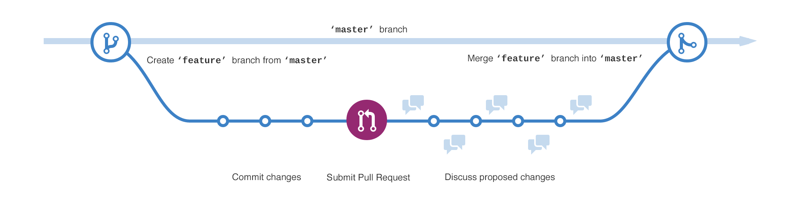

# Version Control System

**장점**

- 프로젝트 소스 버전 관리
- 백업/복구
- 히스토리 관리
- 효율적인 협업

대표적인 Version Control System

Git

- Git-based
  - GitHub
  - Gitlab
  - BitBucket

그 외

SVN

Mercurial

Dimensions CM

Perforce

Bazaar

CVS

SVN → Git

중앙 집중식 버전 관리 시스템 → 분산 관리식 시스템

리눅스 개발자가 만든 Git → 2주만에 완성...ㄷㄷ

## Git을 사용하는 이유

개인

- 원하는 시점으로 원복 가능
- 작업한 내역을 시간 순으로 History 관리
- 수정 이유에 대한 문서화 용이
- 브랜치 관리에 대한 편의성

팀

- 개인 사용에 대한 모든 기능 +
- 수정에 대한 충돌 이슈 해결
- History에 대한 개별적인 관리 가능

# 협업을 왜 해야하는가?라는 질문을 어리석다. 협업은 이제 필수이다.

클라우드 컴퓨팅

인터넷 기반 인프라 활성화

원격근무를 도와줄 도구들

집단 지성의 힘

더 좋은 아이디어로 가치 창출

추가적인 비즈니스 모델

오픈소스 협업

## GitHub란?

- 단순한 git 저장소가 아닌 개발 환경의 중심
- "플랫폼"
- 프로젝트의 모든 구성원들이 함께 모여 논의하고 협업하는 공간

Issue = 버그를 제보하거나 필요한 기능을 요청 또는 일반적인 질문을 할 수 있는 토론을 위한 장소(스레드)

branch = 안전하게 소프트웨어를 변경하여 여러 테스트를 진행할 수 있는 또 다른 타임라인

Pull Request = 브랜치의 생성자가 제한하는 변경 사항을 다른 사람에게 보여줘 리뷰나 토론을 하는 장소 - 모든 사용자가 동의하면 merge 가능

## GitHub Workflow

### CLI(Command Line Interface)

- 툴에 있는 기능보다 더 많은 기능들을 직접 실행 가능
- 다른 툴에 없는 기능을 사용 가능
- 사용하면서 로그들을 확인할 수 있음
